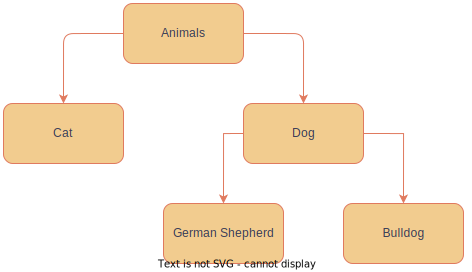
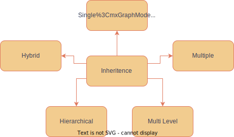

# Inheritence

- A derived class can inherit members of the base class with its own members

## Types of Inheritence

### 1. Single inheritance

### 2. Multiple inheritance

### 3. Hierarchical inheritance

### 4. Multilevel inheritance

### 5. Hybrid inheritance
